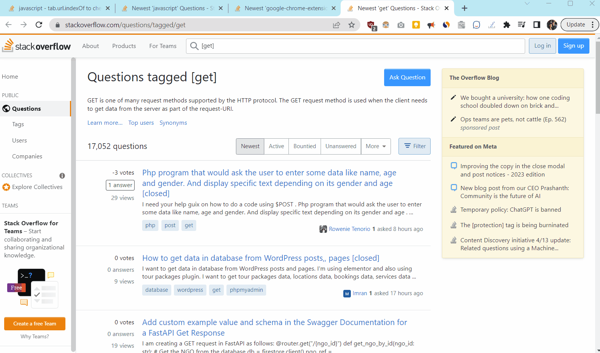

# SleepyStack - Stack Overflow Blocker, Sleep Saver

If you find yourself debugging and searching Stack Overflow until the wee hours of the morning, then SleepyStack can help you get the rest you need! All you have to do is set the window of time during which you want to be locked out of Stack Overflow, and SleepyStack will do the rest. You can also adjust the number of tabs threshold and apply it to other domains.

## Default Settings:
* **Quiet Time Start:** 10PM
* **Quiet Time End:** 6AM
* **Maximum Tab Count:** 5
* **Restricted Domain:** stackoverflow.com

## Demo:

## Using the Extension:

[SleepyStack is now available in the Chrome Web Store!](https://chromewebstore.google.com/detail/sleepystack-stack-overflo/lpboffdogpnikaiahljfiepgmlafmdjb)

If you prefer to run it locally, here's how:

1. Clone this repo so you have the entire SleepyStack app on your computer in a single folder
1. Go to `chrome://extensions/` in your browser
1. Click the "Load unpacked" button in the top right of the page
1. Select the SleepyStack folder in the folder upload dialogue that opens
1. Chrome will add SleepyStack to your browser

Thanks for using the extension!

## Background:

I had the idea for this app a couple of years ago, but I didn't know any Javascript, and I didn't really want to start from scratch, so the idea just sat on the back burner for a while. Then, one night I thought, "Hey, ChatGPT wasn't around when I had this idea, and maybe now I can make an extension even though I don't know Javascript!"

These are the prompts I used:

> "You are a software engineer, and you are developing a Chrome browser extension. I will provide you with an idea of what I'd like an extension to do, and you will produce code and instructions on how to build the Chrome extension and add it to the Chrome web store."

and

> "Please create an extension that will block the website stackoverflow.com if it is between 11pm and 6am and there are more than 10 tabs open in the domain stackoverflow.com"

ChatGPT produced some great code that helped me get started. It made some silly mistakes, like not using the same variable name across files, but I was able to troubleshoot that.

One of the potential pitfalls of coding with ChatGPT that I notices is that when I presented it with a bug, it usually made the code more complex. After a couple attempts at debugging with ChatGPT, I decided I was better off working through it on my own. So, ChatGPT produced the bulk of the code, and I did most of the troubleshooting and debugging so it would actually work. The best part: I had a working prototype in just a couple of hours!

The next evening I worked on the popup and CSS and then submitted to the Chrome Web Store. I spent ~5 hours total working on it, and now I have a working application written in a language that I don't feel confident enough in that I would put it on my resume. There's definitely room for improvement (PRs welcome!), but I'm very pleased with the outcome!
